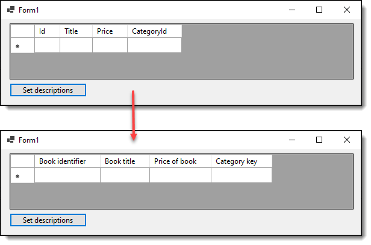

# Change DataGridView column headers

This repository shows how to use the Description properties of columns in a SQL-Server table for changing DataGridView Column HeaderText.

1. In a SQL-Server table, for columns to be used in a DataGridView set the description property
1. In code we use the SELECT statement in the project `DataGridViewLibrary` to fetch column name and description
1. In the form project load your data then call ColumnOperations.ColumnDetails
1. Iterate the columns and set `HeaderText`

To try the code sample, run BookScript.sql (make sure to read the comments in the script). Build the projects, run the project DataGridViewSample. Once the DataGridView is loaded (there are no records as per the first screenshot click the button to change column headers).

For a real app the code in the Click event would be called in Form Shown but did it this way so those reading this can see how the code works.

# History

Code was originally written for [TechNet article November 2018](https://social.technet.microsoft.com/wiki/contents/articles/52160.datagridview-setup-header-text-using-sql-server.aspx) in VB.NET while  the code in this repository is done with .NET Core 6 but with minor code changes will work in .NET Franework as in the TechNet article.

As coded, one table is used, the same can work with joined tables as per [caveats](https://social.technet.microsoft.com/wiki/contents/articles/52160.datagridview-setup-header-text-using-sql-server.aspx#Caveats) in the TechNet article.

# Connection string

Are done using my NuGet package [ConfigurationLibrary](https://www.nuget.org/packages/ConfigurationLibrary/1.0.1?_src=template) which reads `appsettings.json`. Although this code uses a data provider the package also works with Entity Framework Core