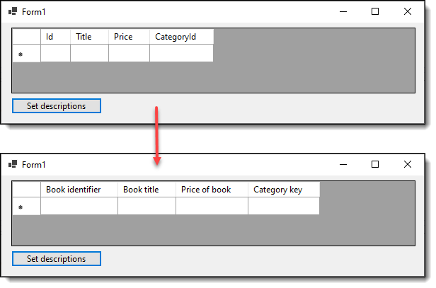

# SQL-Server/C# library

## SqlServerLibraty

## DbPeekQueryLibrary

## SeriLog

## Change DataGridView column headers

This repository shows how to use the Description properties of columns in a SQL-Server table for changing DataGridView Column HeaderText.




1. In a SQL-Server table, for columns to be used in a DataGridView set the description property
1. In code we use the SELECT statement in the project `DataGridViewLibrary` to fetch column name and description
1. In the form project load your data then call ColumnOperations.ColumnDetails
1. Iterate the columns and set `HeaderText`

To try the code sample, run BookScript.sql (make sure to read the comments in the script). Build the projects, run the project DataGridViewSample. Once the DataGridView is loaded (there are no records as per the first screenshot click the button to change column headers).

For a real app the code in the Click event would be called in Form Shown but did it this way so those reading this can see how the code works.

## Base code in form

```csharp
private void SetDataGridViewColumnHeaders()
{
    var columns = ColumnOperations.ColumnDetails(ConnectionString(), "Books");

    foreach (var column in columns)
    {
        dataGridView1.Columns[column.Name]!.HeaderText = column.Description;
    }
}
```

## History

Code was originally written for [TechNet article November 2018](https://social.technet.microsoft.com/wiki/contents/articles/52160.datagridview-setup-header-text-using-sql-server.aspx) in VB.NET while  the code in this repository is done with .NET Core 6 but with minor code changes will work in .NET Franework as in the TechNet article.

As coded, one table is used, the same can work with joined tables as per [caveats](https://social.technet.microsoft.com/wiki/contents/articles/52160.datagridview-setup-header-text-using-sql-server.aspx#Caveats) in the TechNet article.

**08/2023**

- Renamed class project from DataGridViewLibrary to SqlServerLibrary.
- Move to .NET Core 7
- Renamed solution
- Use of Dependency Injection


## Console project connection string

Reads several connection string from appsettings.json

appsettings.json

```json
{
  "App": {
    "TempDirectory": "Temp"
  },

  "ConnectionStrings": {
    "NorthWindConnection": "Server=(localdb)\\MSSQLLocalDB;Database=NorthWind2022;Trusted_Connection=True",
    "BooksConnection": "Server=(localdb)\\mssqllocaldb;Database=EF.BookCatalog1;Trusted_Connection=True",
    "ComputedConnection": "Server=(localdb)\\mssqllocaldb;Database=ComputedSample2;Trusted_Connection=True"
  },

  "Logging": {
    "LogLevel": {
      "Default": "Information",
      "Microsoft": "Information",
      "Microsoft.Hosting.Lifetime": "Information",
      "Microsoft.EntityFrameworkCore": "None"
    }
  }
}
```

Code to read connection strings

```csharp
public static ServiceCollection ConfigureServices()
{
    static void ConfigureService(IServiceCollection services)
    {
        services.AddLogging(builder =>
        {
            builder.AddConsole();
            builder.AddDebug();
            builder.AddConfiguration(ConfigurationRoot().GetSection("Logging"));
        });

        services.Configure<ConnectionStrings>(ConfigurationRoot()
            .GetSection(nameof(ConnectionStrings)));


        services.AddSingleton<ColumnInformation>();
        services.AddSingleton<ConstraintInformation>();
    }

    var services = new ServiceCollection();
    ConfigureService(services);

    return services;

}
```

## DataGridView project connection string

Are done using my NuGet package [ConfigurationLibrary](https://www.nuget.org/packages/ConfigurationLibrary/1.0.1?_src=template) which reads `appsettings.json`. Although this code uses a data provider the package also works with Entity Framework Core

The alternate involves many packages for **Microsoft.Extensions.Configuration** while the above is easier.